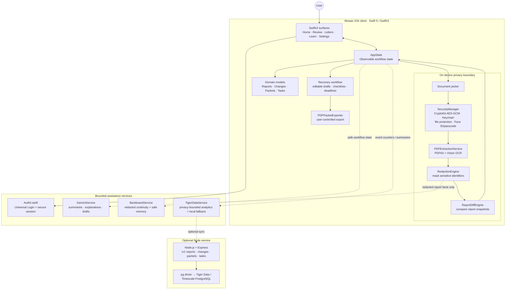
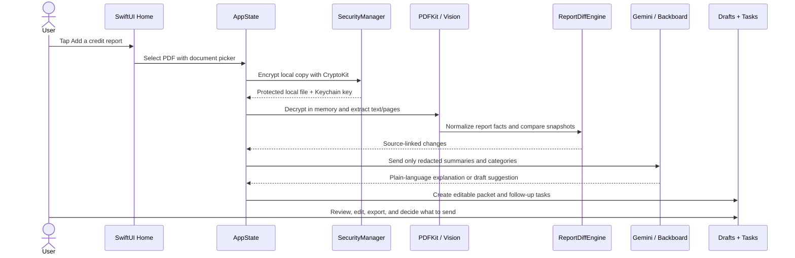

# Mosaic — Financial Control & Credit Health iOS Agent

Mosaic is a privacy-first native iPhone application that helps people understand changes in their credit file, decide what deserves attention, and organize a documented next step. The experience is designed around clarity and user control: sensitive source documents are processed locally, AI assistance works from bounded report facts, and every recovery action remains a draft for personal review.

The product flow is intentionally structured as a progression from evidence to agency:

```text
credit-report PDF or synthetic fixture
  -> extract text and redact identifiers on-device
  -> normalize accounts, inquiries, and addresses
  -> compare current and prior report snapshots
  -> explain changes with source-page context
  -> let the user classify each item
  -> prepare editable recovery documents and checklists
  -> track follow-up dates, delivery, and resolution
  -> record privacy-bounded workflow analytics
```

## Architecture at a glance

The system is intentionally local-first: the iOS client owns the original report and the decision workflow, while external services receive only bounded, redacted context.



### Runtime path: importing a report and taking action

This sequence is the product’s core trust model: source documents remain on-device, assistance is constrained to redacted facts, and the user confirms every external action.



## Technology stack

| Layer | Technology | Responsibility |
|---|---|---|
| App client | Swift 5, SwiftUI, iOS 16+ deployment target | Native screens, navigation, state-driven workflows, accessibility, and device integration |
| Authentication | Auth0.swift 2.22, JWTDecode, SimpleKeychain | Universal Login, credential renewal, secure session storage, and identity context |
| Document processing | Apple PDFKit and Vision | Local PDF reading, scanned-page OCR fallback, page references, and report preview |
| Privacy and security | CryptoKit, Keychain, LocalAuthentication, security-scoped file access | AES-GCM encrypted local PDFs, Face ID/passcode unlock, temporary-file handling, and privacy controls |
| Report intelligence | `PDFExtractionService`, `RedactionEngine`, `ReportDiffEngine` | Convert source documents into masked, normalized report facts and explainable differences |
| AI assistance | `GeminiService`, Google Gemini API | Short summaries, plain-language explanations, recommended next steps, and editable document drafts |
| Workflow continuity | `BackboardService`, Backboard REST API | Privacy-bounded conversation continuity and workflow memory without sending original report documents |
| Analytics and persistence | `TigerDataService`, Node.js, Express, `pg`, Tiger Data / Timescale PostgreSQL | Redacted workflow events, task progress, audit records, and time-series summaries with a local fallback |
| Audio interaction | AVFoundation and Speech | Optional voice input for asking questions or recording a note for the workflow |
| Interface system | Apple SF Symbols, SwiftUI materials, Mosaic liquid-glass components | Consistent navigation, controls, feedback states, and platform-native visual behavior |

The client is the primary product surface. The optional backend receives identifiers and workflow facts that have already passed through the app’s privacy boundary; it is not the source of truth for the original PDF.

## Repository structure

```text
Mosaic/
├── MosaicApp.swift                 App entry point
├── ContentView.swift               Auth, loading, lock, and root routing
├── MainTabView.swift               Primary app navigation
├── ViewModels/
│   └── AppState.swift              Shared session and workflow state
├── Models/                         Report, change, packet, task, and analytics models
├── Services/
│   ├── PDFExtractionService.swift  PDFKit/Vision extraction
│   ├── RedactionEngine.swift       Local identifier masking
│   ├── ReportDiffEngine.swift      Snapshot comparison
│   ├── GeminiService.swift         AI summaries and draft generation
│   ├── BackboardService.swift      Bounded conversation continuity
│   ├── TigerDataService.swift      Analytics adapter and local fallback
│   ├── SecurityManager.swift       Local PDF encryption, authentication, and cleanup
│   └── PDFPacketExporter.swift     Recovery packet export
├── Views/
│   ├── Root/                       Welcome and privacy notice
│   ├── Overview/                   Home summary and Ask Mosaic
│   ├── Scan/                       Import, review, comparison, and source pages
│   ├── Recovery/                   Letters, checklists, deadlines, and exports
│   ├── Learn/                      Plain-language financial guidance
│   └── Settings/                   Privacy, account, and developer controls
├── Components/                     Shared liquid glass, typography, color, and safety UI
├── Resources/Fonts/                Neue Montreal app typography
└── Assets.xcassets/                App icon and Mosaic brand assets

server/
├── server.js                       Express API and service fallback
├── schema.sql                      Tiger Data / Timescale PostgreSQL schema
└── package.json                    Node runtime dependencies and start command
```

## Data flow and privacy boundary

1. The user selects a report PDF through the iOS document picker.
2. `SecurityManager` stores an AES-GCM encrypted local copy using a Keychain-held key and file protection.
3. `PDFExtractionService` decrypts the protected copy in memory, reads digital text locally, and uses Vision when a page needs OCR.
4. `RedactionEngine` masks sensitive identifiers before any AI or service request is built.
5. `ReportDiffEngine` compares normalized snapshots and preserves source-page references.
6. Gemini and Backboard receive only the bounded, redacted facts needed for a response or draft.
7. The user reviews, edits, exports, and sends any document themselves. Mosaic does not submit disputes automatically.
8. Tiger Data / Timescale stores workflow-level analytics and audit events, not original unredacted PDFs.

The privacy model is deliberately layered: local source handling first, redaction second, bounded assistance third, and user confirmation before any external action.

## Requirements

- Xcode 16+
- iOS 16.0+ deployment target
- macOS with Swift 5.9+
- Node.js 18+ for the optional API server
- PostgreSQL-compatible Tiger Data / Timescale instance for hosted analytics

## Quick start

1. Open the project in Xcode:

   ```bash
   open Mosaic.xcodeproj
   ```

2. Select an iPhone simulator and press **Cmd + R**.

3. For a deterministic local walkthrough, add `--demo` to the scheme’s launch arguments. Mosaic bypasses sign-in, loads the synthetic prior/current reports, and keeps the sample-data label visible. To exercise the document-picker path instead, use the debug-only `--import-file=/absolute/path/to/mosaic-synthetic-credit-report.pdf` argument.

4. For an authenticated session, configure Auth0 and use the app’s native sign-in flow.

## Configuration

### Auth0

Auth0 is configured for a native iOS application. The project stores the local callback configuration in `Mosaic/Auth0.plist`; `Configure.swift` can update environment-specific values without changing the app architecture.

The callback and logout URLs must match the application’s bundle identifier and the callback mode selected in `Mosaic/Auth0.plist`.

### Gemini

The iOS service reads the Gemini configuration through `SecretsConfig`. The optional server reads `GEMINI_API_KEY` from its environment. Keep keys out of source control and use `Mosaic/Secrets.example.plist` as the local configuration template.

### Tiger Data / Timescale

The server uses PostgreSQL-compatible `pg` connections and can run with a local in-memory fallback when the database is unavailable. To configure a hosted instance:

```bash
cd server
npm install

export TIGER_DATA_PASSWORD=your_password_here
export GEMINI_API_KEY=your_key_here
npm start
```

Apply the schema with the database connection configured for the environment:

```bash
psql "$DATABASE_URL" -f server/schema.sql
```

### iPhone cloud sync

The iOS client uses the API as the source of truth for structured workspace state: report snapshots, redacted change items, classifications, recovery packets, tasks, the letter profile, and analytics. The original PDF remains encrypted in the iOS container and is not uploaded by the sync endpoint.

Set the API base URL in the local ignored `Mosaic/Secrets.plist` or through the `MOSAIC_API_BASE_URL` environment value:

```text
MOSAIC_API_BASE_URL=https://your-deployed-api.example.com
```

The API verifies the Auth0 ID token and associates the workspace with its Auth0 `sub`. Any user who successfully authenticates through the configured Auth0 application can sign in, including `skmpe15@gmail.com`; the email is not hardcoded in the client. The user must exist and be enabled in Auth0 User Management.

For a physical iPhone, use an HTTPS API hostname reachable from the device. `localhost` points to the phone itself, not the development Mac. Configure the server with `AUTH0_DOMAIN`, `AUTH0_CLIENT_ID`, and `AUTH0_AUDIENCE`, apply `server/schema.sql`, then configure automatic signing and the Auth0 callback settings in Xcode.

## Core privacy and safety principles

- **Original documents stay local.** The source PDF is processed in the iOS container.
- **Identifiers are masked before assistance.** SSNs, full account numbers, addresses, phone numbers, and email addresses are redacted before cloud-bound prompts.
- **Language stays factual.** The app describes changes and review needs without declaring fraud, abuse, identity theft, or a legal outcome.
- **The user stays in control.** Letters, worksheets, and checklists are editable drafts; Mosaic never submits a dispute automatically.
- **Safety controls are first-class.** Face ID/passcode locking, discreet notifications, temporary-file cleanup, and emergency data removal protect a sensitive workflow.

## Development notes

- Keep report parsing, redaction, and diffing deterministic and testable independently of network services.
- Keep AI prompts limited to masked report facts and explicit user questions.
- Preserve source-page references so every recommendation can be checked against the original report.
- Treat synthetic fixtures as demo-only data and keep them clearly separated from real user records.
- Use Apple frameworks and the existing service boundaries before introducing new dependencies.
