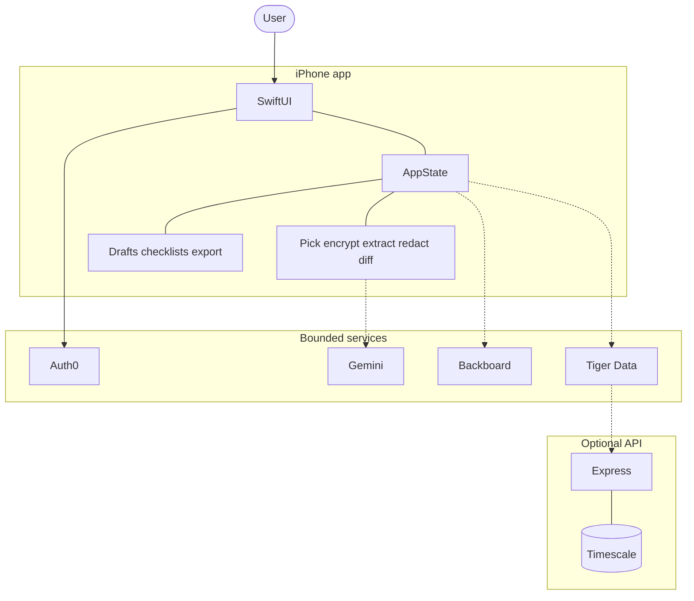
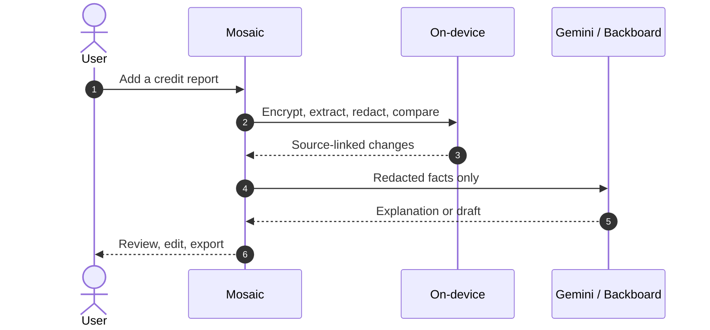

<p align="center">
  
</p>

<p align="center">
  <strong>Privacy-first credit health for iPhone.</strong><br>
  Import a report, see what changed, and keep the next step in your control.
</p>

<p align="center">
  
  
  
  
  
  
  
  
</p>

<p align="center">
  <a href="#tech-stack">Tech stack</a>
  &nbsp;·&nbsp;
  <a href="#architecture">Architecture</a>
  &nbsp;·&nbsp;
  <a href="#quick-start">Quick start</a>
  &nbsp;·&nbsp;
  <a href="#privacy">Privacy</a>
</p>

---

Mosaic is a native iPhone app that helps people understand changes in a credit file, decide what deserves attention, and organize a documented next step. Source documents stay on-device. AI assistance only sees redacted report facts. Every recovery action remains a draft for personal review.

<table>
  <tr>
    <td width="56" align="center" valign="top">
      
    </td>
    <td>
      <strong>Import locally.</strong> PDFs are encrypted in the iOS container with CryptoKit and Keychain. They are not uploaded.
    </td>
  </tr>
  <tr>
    <td align="center" valign="top">
      
    </td>
    <td>
      <strong>See what changed.</strong> Mosaic extracts, redacts, and compares report snapshots with source-page context.
    </td>
  </tr>
  <tr>
    <td align="center" valign="top">
      
    </td>
    <td>
      <strong>Stay in control.</strong> Letters, checklists, and packets are editable drafts. Mosaic never submits a dispute.
    </td>
  </tr>
</table>

<br>

<details>
<summary><strong>Product flow</strong></summary>

```text
credit-report PDF or synthetic fixture
  -> extract text and redact identifiers on-device
  -> normalize accounts, inquiries, and addresses
  -> compare current and prior report snapshots
  -> explain changes with source-page context
  -> let the user classify each item
  -> prepare editable recovery documents and checklists
  -> track follow-up dates, delivery, and resolution
  -> record privacy-bounded workflow analytics
```

</details>

---

<h2 id="tech-stack">
  
  Tech stack
</h2>

<p align="center">
  
</p>

### Client

| | Technology | Role |
|---|---|---|
|  | **Swift 5** · SwiftUI · iOS 16+ | Native screens, navigation, and state-driven workflows |
|  | **Xcode 16+** · SF Symbols | Build, signing, and platform-native controls |
|  | **PDFKit** · Vision · CryptoKit | On-device extraction, OCR fallback, AES-GCM encryption |
|  | **Keychain** · LocalAuthentication | Face ID / passcode lock and protected file keys |
|  | **AVFoundation** · Speech | Optional voice input for questions and notes |

### Services

| | Technology | Role |
|---|---|---|
|  | **Auth0.swift 2.22** · JWTDecode · SimpleKeychain | Universal Login, session renewal, secure credentials |
|  | **Google Gemini** via `GeminiService` | Summaries, explanations, recommended steps, editable drafts |
|  | **Backboard** via `BackboardService` | Privacy-bounded conversation continuity and workflow memory |
|  | **Tiger Data / Timescale** via `TigerDataService` | Redacted analytics, audit events, local fallback |

### Optional API

| | Technology | Role |
|---|---|---|
|  | **Node.js 18+** · Express 4 | `/v1` reports, changes, packets, tasks, and workspace sync |
|  | **PostgreSQL** · `pg` | Timescale-compatible persistence for workflow facts |
|  | **Auth0 JWKS** | Verifies the iOS ID token and scopes workspace by `sub` |

The iOS client is the source of truth for the original PDF. The API only receives identifiers and workflow facts that have already passed the privacy boundary.

---

<h2 id="architecture">
  
  Architecture
</h2>

The system is local-first. The iOS client owns the original report and the decision workflow. External services receive only bounded, redacted context.



Redacted report facts go to Gemini. Safe workflow state goes to Backboard. Event counters go to Tiger Data, which can optionally sync to Express.

### Runtime path

Source documents remain on-device. Assistance is constrained to redacted facts. The user confirms every external action.



---

<h2>
  
  Repository structure
</h2>

```text
Mosaic/
├── MosaicApp.swift                 App entry point
├── ContentView.swift               Auth, loading, lock, and root routing
├── MainTabView.swift               Primary app navigation
├── ViewModels/
│   └── AppState.swift              Shared session and workflow state
├── Models/                         Report, change, packet, task, and analytics models
├── Services/
│   ├── PDFExtractionService.swift  PDFKit / Vision extraction
│   ├── RedactionEngine.swift       Local identifier masking
│   ├── ReportDiffEngine.swift      Snapshot comparison
│   ├── GeminiService.swift         AI summaries and draft generation
│   ├── BackboardService.swift      Bounded conversation continuity
│   ├── TigerDataService.swift      Analytics adapter and local fallback
│   ├── SecurityManager.swift       Local PDF encryption, authentication, and cleanup
│   └── PDFPacketExporter.swift     Recovery packet export
├── Views/
│   ├── Root/                       Welcome and privacy notice
│   ├── Overview/                   Home summary and Ask Mosaic
│   ├── Scan/                       Import, review, comparison, and source pages
│   ├── Recovery/                   Letters, checklists, deadlines, and exports
│   ├── Learn/                      Plain-language financial guidance
│   └── Settings/                   Privacy, account, and developer controls
├── Components/                     Shared liquid glass, typography, color, and safety UI
├── Resources/Fonts/                Neue Montreal app typography
└── Assets.xcassets/                App icon and Mosaic brand assets

server/
├── server.js                       Express API and service fallback
├── schema.sql                      Tiger Data / Timescale PostgreSQL schema
└── package.json                    Node runtime dependencies and start command
```

---

<h2 id="privacy">
  
  Privacy
</h2>

1. The user selects a report PDF through the iOS document picker.
2. `SecurityManager` stores an AES-GCM encrypted local copy using a Keychain-held key.
3. `PDFExtractionService` decrypts in memory, reads digital text locally, and uses Vision when a page needs OCR.
4. `RedactionEngine` masks identifiers before any AI or service request is built.
5. `ReportDiffEngine` compares normalized snapshots and keeps source-page references.
6. Gemini and Backboard receive only the bounded, redacted facts needed for a response.
7. The user reviews, edits, exports, and sends any document themselves.
8. Tiger Data / Timescale stores workflow-level analytics, not original unredacted PDFs.

| Principle | Meaning |
|---|---|
| Original documents stay local | The source PDF is processed in the iOS container |
| Identifiers are masked first | SSNs, full account numbers, addresses, phones, and emails are redacted before cloud prompts |
| Language stays factual | The app describes changes without declaring fraud, identity theft, or a legal outcome |
| The user stays in control | Mosaic never submits a dispute automatically |
| Safety is first-class | Face ID / passcode lock, discreet notifications, temp-file cleanup, and emergency data removal |

---

<h2>
  
  Requirements
</h2>

- Xcode 16+
- iOS 16.0+ deployment target
- macOS with Swift 5.9+
- Node.js 18+ for the optional API server
- PostgreSQL-compatible Tiger Data / Timescale instance for hosted analytics

---

<h2 id="quick-start">
  
  Quick start
</h2>

1. Open the project in Xcode:

   ```bash
   open Mosaic.xcodeproj
   ```

2. Select an iPhone simulator and press **Cmd + R**.

3. For a deterministic local walkthrough, add `--demo` to the scheme’s launch arguments. Mosaic bypasses sign-in, loads the synthetic prior/current reports, and keeps the sample-data label visible. To exercise the document-picker path instead, use the debug-only `--import-file=/absolute/path/to/mosaic-synthetic-credit-report.pdf` argument.

4. For an authenticated session, configure Auth0 and use the app’s native sign-in flow.

---

<h2>
  
  Configuration
</h2>

### Auth0

Auth0 is configured for a native iOS application. Local callback settings live in `Mosaic/Auth0.plist`. `Configure.swift` can update environment-specific values without changing the app architecture.

The callback and logout URLs must match the application’s bundle identifier and the callback mode selected in `Mosaic/Auth0.plist`.

### Gemini

The iOS service reads Gemini configuration through `SecretsConfig`. The optional server reads `GEMINI_API_KEY` from its environment. Keep keys out of source control and use `Mosaic/Secrets.example.plist` as the local template.

### Tiger Data / Timescale

The server uses PostgreSQL-compatible `pg` connections and can run with a local in-memory fallback when the database is unavailable.

```bash
cd server
npm install

export TIGER_DATA_PASSWORD=your_password_here
export GEMINI_API_KEY=your_key_here
npm start
```

Apply the schema with the database connection configured for the environment:

```bash
psql "$DATABASE_URL" -f server/schema.sql
```

### iPhone cloud sync

The iOS client uses the API as the source of truth for structured workspace state: report snapshots, redacted change items, classifications, recovery packets, tasks, the letter profile, and analytics. The original PDF remains encrypted in the iOS container and is not uploaded.

Set the API base URL in the local ignored `Mosaic/Secrets.plist` or through `MOSAIC_API_BASE_URL`:

```text
MOSAIC_API_BASE_URL=https://your-deployed-api.example.com
```

The API verifies the Auth0 ID token and associates the workspace with its Auth0 `sub`. Any user who successfully authenticates through the configured Auth0 application can sign in. The user must exist and be enabled in Auth0 User Management.

For a physical iPhone, use an HTTPS API hostname reachable from the device. `localhost` points to the phone itself, not the development Mac. Configure the server with `AUTH0_DOMAIN`, `AUTH0_CLIENT_ID`, and `AUTH0_AUDIENCE`, apply `server/schema.sql`, then configure automatic signing and the Auth0 callback settings in Xcode.

---

<h2>
  
  Development notes
</h2>

- Keep report parsing, redaction, and diffing deterministic and testable independently of network services.
- Keep AI prompts limited to masked report facts and explicit user questions.
- Preserve source-page references so every recommendation can be checked against the original report.
- Treat synthetic fixtures as demo-only data and keep them clearly separated from real user records.
- Use Apple frameworks and the existing service boundaries before introducing new dependencies.
